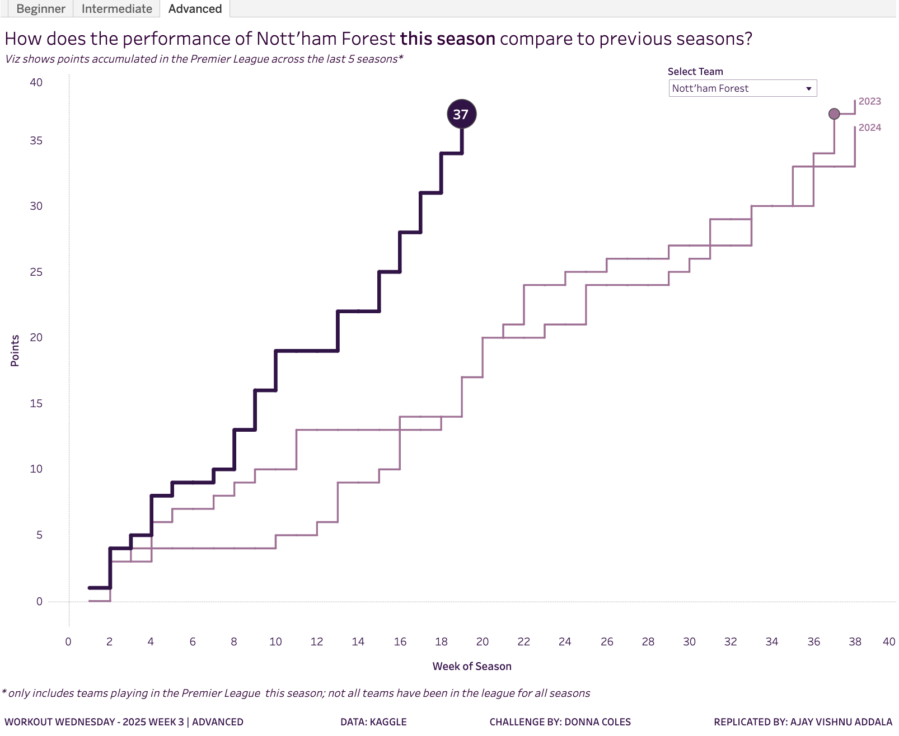

# WOW2025 | Week 3 | How are EPL Football Teams performing this season compared to previous seasons?

This Tableau dashboard analyzes the performance of English Premier League football teams over the last five seasons (2020/21 to midway through 2024/25). It was created as part of the #WorkoutWednesday 2025 Week 3 challenge.

## 🖼️ Dashboard Snapshot

## 📊 Dashboard Features
### Beginner Level:
- Pivoted data for 2 rows per match (home and away teams).
- Calculation of points per match:
  - 3 points for a win.
  - 1 point for a draw.
  - 0 points for a loss.
- Stepped line chart showing points accrued by week, filtered by team.
- Highlighted the latest season with a distinctive color and size.
- Aligned and formatted labels and tooltips.

### Intermediate Level:
- Added a circular indicator for the latest points in the current season.
- Highlighted the first week in previous seasons where the points were at least equal to the current season's latest points.
- Ensured mark sizes vary between the latest and previous seasons.

### Advanced Level:
- Tooltips for previous seasons' circular marks indicate how many weeks more or less it took to reach the same points as the current season.
- Restricted filter to teams participating in the current season (2024/25).

## 📂 Repository Contents
- The dataset used for analysis.
- The Tableau workbook file.
- A snapshot of the final dashboard.
- A video walkthrough of the dashboard.

## 🌟 Tableau Public Link
Check out the interactive dashboard on Tableau Public: [WOW2025 Week 3 Dashboard](https://public.tableau.com/views/WOW2025W3WorkoutWednesday/Advanced?:language=en-US&:sid=&:redirect=auth&:display_count=n&:origin=viz_share_link)

